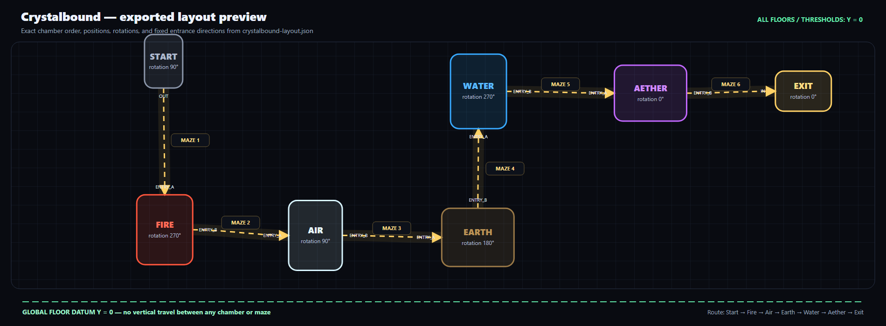
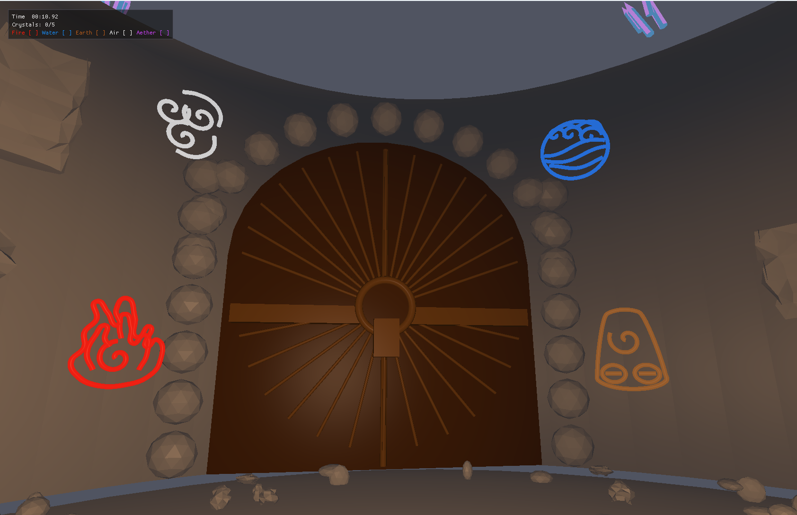
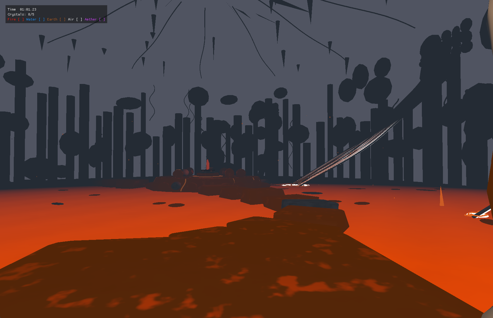
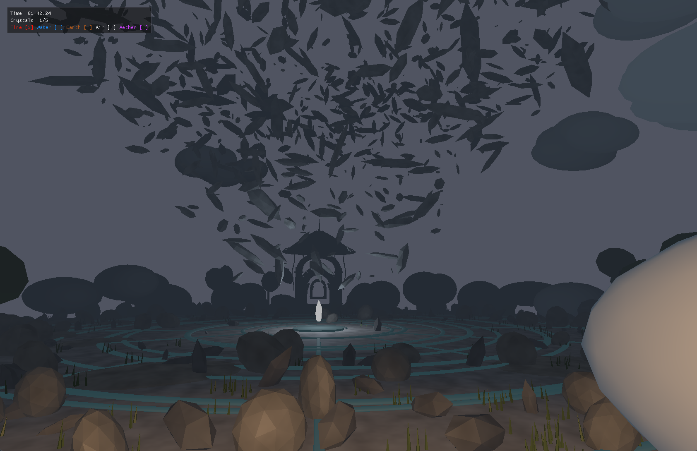
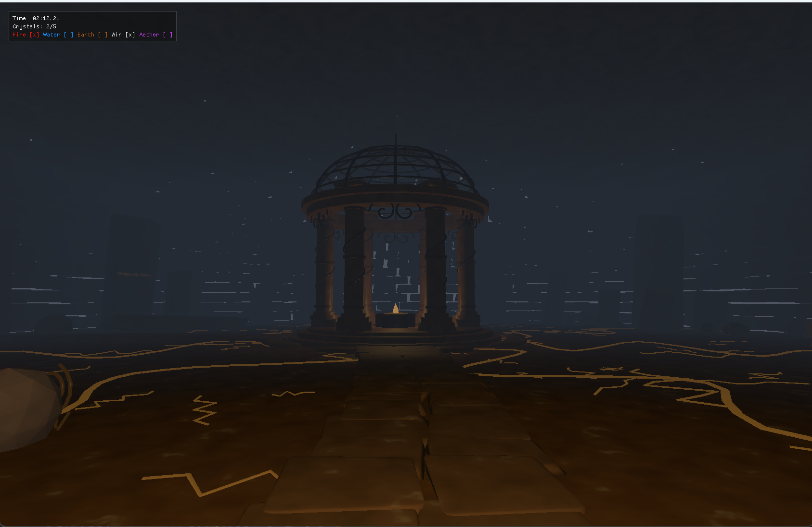
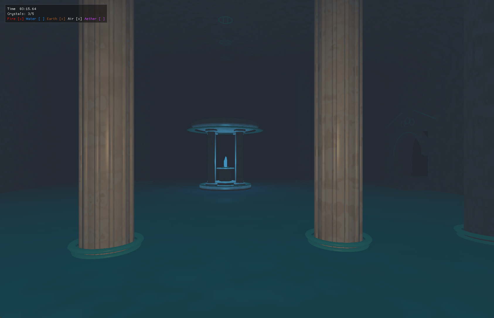
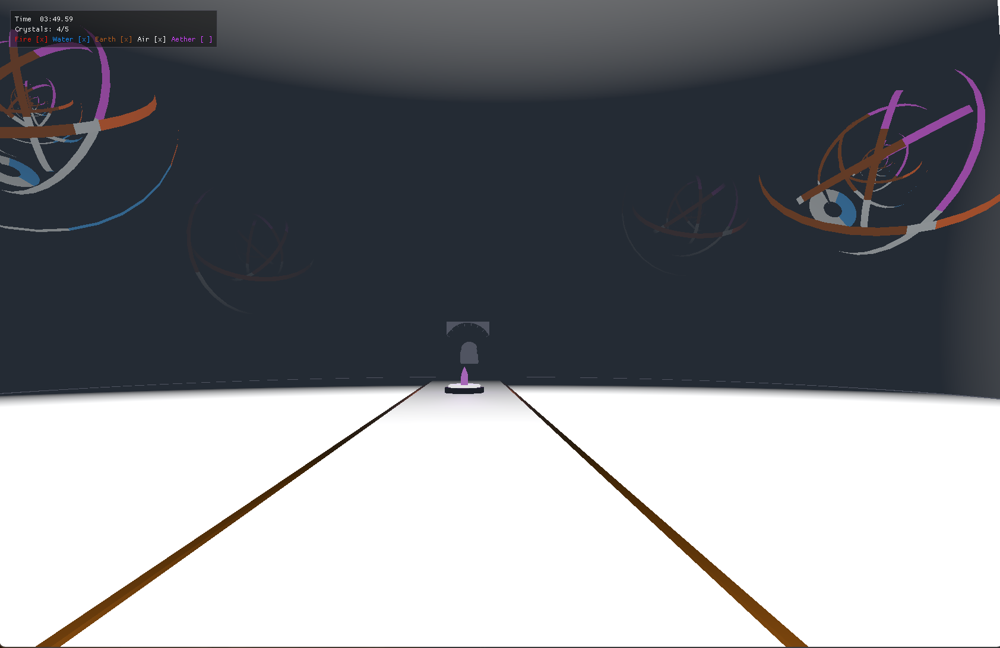
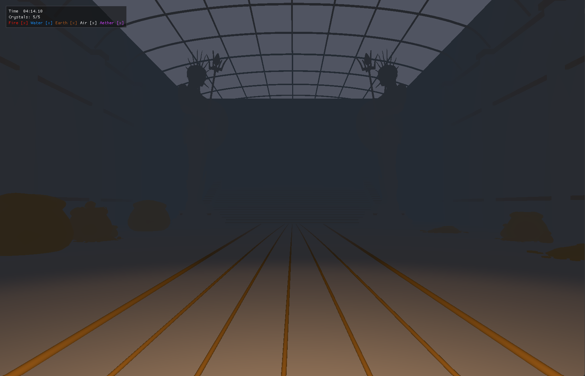

# Crystalbound: Game and Development Documentation

## 1. What the game is about

Crystalbound is a first-person 3D cave-exploration game. The player begins in a
start chamber and travels through a sequence of tunnels, maze rooms, and
elemental chambers. The main objective is to solve the mazes, find and collect
five elemental crystals, and reach the final exit as quickly as possible.

The five crystals are Fire, Air, Earth, Water, and Aether. Each crystal is kept
inside a chamber with a distinct visual identity. Fire uses lava and dark
volcanic materials; Air uses wood and open, tall forms; Earth uses heavy rock
and mineral forms; Water uses pools, cool marble, and mist; and Aether uses
purple light and supernatural crystal forms. These landmarks help the player
understand where they are without a map.

I kept the main chamber order fixed:

`Start -> Fire -> Air -> Earth -> Water -> Aether -> Exit`

There are five generated maze rooms, one on each connection from Start through
the five elemental chambers. The final Aether-to-Exit connection is a direct
tunnel, so there is deliberately no sixth maze. The major route therefore
moves in one direction from the start to the exit, while each maze contains
turns, branches, and dead ends that the player must explore.

The main gameplay loop is:

1. Read the objective and controls on the start screen.
2. Explore with the first-person camera.
3. Travel through a tunnel and solve the next generated maze.
4. Enter an elemental chamber and locate its glowing crystal.
5. Aim at the crystal from a valid distance and press `E` to collect it.
6. Repeat until all five elemental crystals have been collected.
7. Reach the exit chamber, approach the activated arch, and press `E` to
   finish the run.

A timer measures the full run. There is no combat, map, sound system, or fuel
mechanic. Instead, the player has to read the environment. Chamber shapes,
colors, lights, and decorations act as landmarks. Solid objects block movement,
and falling into a hazard such as lava returns the player to a safe entrance.

## 2. Foundation

Crystalbound is an offline C++17 application built with CMake and OpenGL 3.3.
Its main supporting libraries are GLFW for the window and input, GLAD for
OpenGL function loading, GLM for vector and matrix mathematics, Dear ImGui for
the interface, and tinyobjloader for Blender exported OBJ models.

## 3. Blender
Blender models provide detailed chamber, maze, tunnel, prop, and crystal render geometry.
I first designed the rooms and chambers object to use in the game using blender, then exported them as an obj file to load in the game.

### When I add or update a model, I use this process:

1. Model the room or component in Blender at the intended game scale.
2. Keep doorway locations fixed and clearly separated from decoration.
3. Apply object transforms before export.
4. Export triangulated OBJ geometry with normals, UVs, and an accompanying MTL
   file.
5. Copy the OBJ and MTL into `assets/models/`.
6. Inspect bounds, material groups, triangle counts, and doorway locations.
7. Define one runtime placement transform for the complete model.
8. Build simple collision from floors, stairs, walls, pillars, hazards, and
   other gameplay surfaces.
9. Align tunnel endpoints with the authored doorway thresholds.
10. Run focused collision and traversal tests, then inspect the room in game.

### Chambers:

- ### Start Chamber:

- ### Fire chamber:

- ### Air chamber:

- ### Earth chamber:

- ### Water chamber:

- ### Aether Chamber:

- ### Exit chamber:

### Maze Room:

## 4. Where the course material appears in the game

### 4.1 Meshes and geometry

All chambers, tunnels, maze pieces, props, and crystals are indexed triangle
meshes. Each vertex contains a position, normal, and UV coordinate. The OBJ
loader triangulates the Blender models and repairs invalid normals before the
mesh is uploaded to OpenGL through a VAO, VBO, and EBO.

### 4.2 Transformations and viewing

I use model matrices to place and animate objects. The first-person camera
provides the `lookAt` view matrix, and a perspective matrix creates depth on
screen. Mouse movement changes yaw and pitch; a separate normal matrix keeps
the lighting correct after rotation or scaling.

### 4.3 OpenGL and GLSL shaders

OpenGL 3.3 uploads the meshes and textures, sends shader uniforms, and draws the
scene. The vertex shader performs the model-view-projection transform. The
fragment shader calculates materials, lighting, animation, and fog, with
separate passes for solid and transparent effects.

### 4.4 Lighting and shading

Lighting follows the Phong model: ambient light prevents complete darkness,
diffuse light shows the surface direction, and specular light adds highlights.
The lantern and crystals are point lights with distance attenuation. Crystal
emission keeps the crystal mesh bright as its light colors nearby surfaces.

### 4.5 Texture mapping

Wood and water use their mesh UVs with repeating coordinates and linear
filtering. For uneven rock walls, triplanar mapping avoids much of the
stretching caused by a single UV projection. OBJ material colors are kept, but
the renderer does not use normal maps.

### 4.6 Procedural textures

The rock and wood textures are 128×128 images generated on the CPU. They mix
several octaves of periodic value noise in a way similar to FBm. The shaders
also use this noise for lava, water, marble, soil, bark, Aether, and mist, and
a repeated seed produces the same texture data.

### 4.7 Hidden surface removal

The Z-buffer uses `GL_DEPTH_TEST` with `GL_LESS`, so only the nearest visible
surface remains. Solid geometry writes depth first. Water, mist, and other
blended effects are drawn afterward with their own depth rules.

### 4.8 Procedural modeling

The seven chambers stay in fixed positions, but the five maze layouts are
generated from the run seed. C++ places copies of the Blender wall, pillar,
arch, tunnel, and decoration models. Collision comes from those same
placements, so the visible pieces and blockers line up.

### 4.9 Animation and rigid motions

The elemental crystals move, rotate, change scale, and pulse their emission over
time. Smaller versions animate in the exit sockets. Time values sent to the
shader also move lava, water, bark, Aether, and mist effects; no skeletal
animation is needed.

## 5. How the random maze generation works

The generator uses randomized depth first search, commonly called the
recursive backtracker maze algorithm. The implementation uses an explicit
stack rather than recursive function calls:

1. Mark all 63 cells unvisited.
2. Start at the center cell of the entrance row.
3. Mark that cell visited and push it onto a stack.
4. Inspect its unvisited north, south, east, and west neighbours that remain
   inside the grid.
5. If at least one neighbour is available, choose one with the seeded random
   generator, record a passage between the cells, store the current cell as the
   new cell's parent, mark the new cell visited, and push it on the stack.
6. If no unvisited neighbour is available, pop the current cell and backtrack
   until another unfinished branch is found.
7. Continue until the stack is empty and every cell has been visited.
8. Begin with every internal cell boundary treated as a possible wall. Remove
   the boundaries recorded as passages; instantiate walls for every boundary
   that remains.
9. Starting from the center cell at the opposite door, follow stored parent
   cells back to the entrance and reverse the result. This produces the
   verified solution-cell sequence.

Depth first search produces a spanning tree over the grid. That tree reaches
every cell, so the entrance and exit cannot become disconnected. It also has
no cycles. The result is a *perfect maze* with one simple route between any two
cells, even though the player still sees branches and dead ends.
